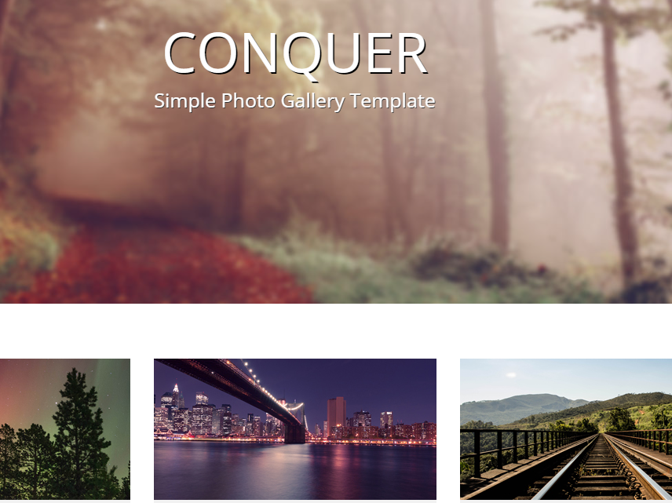

# Conquer The Natural

    

## About This Portfolio/Project Details

About This project and the reference link in this repo are for anyone who is interested in working to enter developer world to produce high quality, working style! Check out follow reference link if you think it is interested.

**Project Link:** [Conquer The Natural](http://bdfdportfolio.tk/Portfolio01_Natural-Photo-Gallery)

## Project Details

The Project Page enlisted as follows:

- [x] **P1-Natural Photo Gallery Landing Page**

## Project Description:

 

## Tools Used In This Project

**Tools:** GitHub, Visual Studio Code Editor

**Libraries:** HTML, CSS, and JavaScript

**Projects:** Conquer The Natural

**Reference:**  
Demo: <a href="http://bdfdportfolio.tk/Portfolio01_Natural-Photo-Gallery">Demo Website Link</a>  
Reference:

- <a href="https://github.com/BDFDPortfolio/Portfolio01_Natural-Photo-Gallery">Orginal Data Source Link</a>
   

### Thanks For Watch This Repositories!

### <i>KEEP AWESOME & STAY COOL!</i>

### Feel Free To Fork And Report If You Find Any Issue :)

